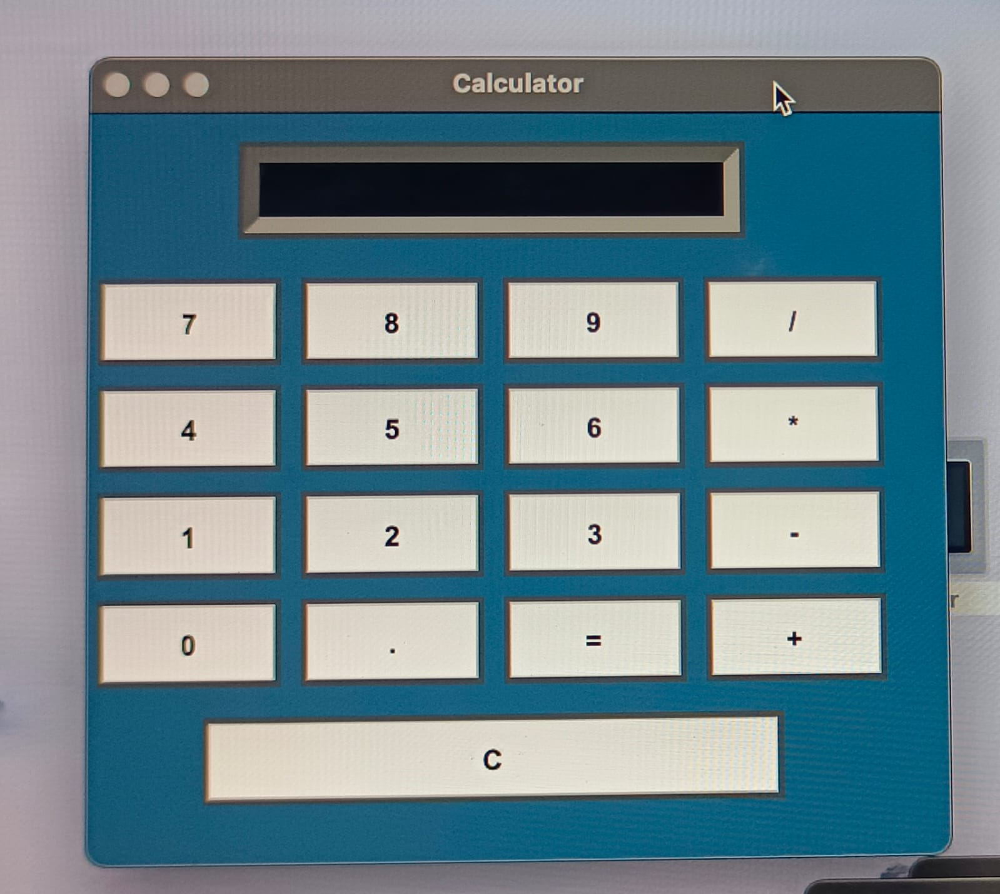

# 🧮 Calculator Project

A simple and user-friendly **Calculator Application** built using **Python** and **Tkinter GUI**.  
This project is perfect for beginners to understand how to create desktop applications with Python.

---

## ✨ Features
- ➕ Addition, ➖ Subtraction, ✖ Multiplication, ➗ Division
- 🎨 Simple and clean GUI using Tkinter
- ⌨️ Keyboard input support (optional)
- 🖱 Button-based operations
- 🚀 Beginner-friendly code structure

---
## 📸 Screenshots
Here is the preview of the calculator:

